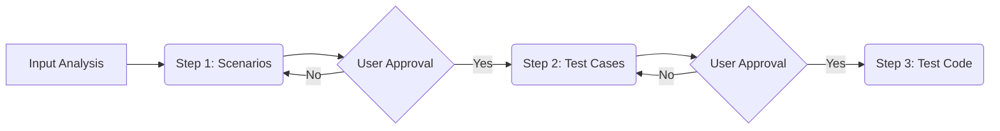

# Auto Test Generator

## Overview

This skill enforces a strict "Think, Plan, Then Code" protocol for automated test generation to eliminate the need for constant user supervision. It prioritizes systematic verification over speed by compelling the agent to output an explicit strategy (Markdown) before implementation. Its goal is to eradicate happy-path bias, flaky tests due to improper mocking, and low coverage through structured discipline.

Enforces "Think, Plan, Then Code" protocol for test generation to eliminate manual supervision. Requires explicit strategy before implementation to prevent happy-path bias and ensure comprehensive coverage.

## Workflow

Follow this **Mandatory 3-Step Protocol**. You must obtain USER APPROVAL after Step 1 and Step 2 before proceeding.


* Core Rule: Do NOT generate code until Step 3.

### Step 1: Scenario Generation
Goal: Define **WHAT** to verify based on User Behavior and Business Logic.

Preliminary Task:
- Identify the Target Scope from the user's prompt.
- Determine the appropriate Test Level (Unit, Integration, E2E, Smoke) based on the scope and user intent.
- Analyze the source code ONLY within the identified Target Scope to reverse-engineer business requirements and user journeys before drafting scenarios.

Principles
- Describe the functionality from the end-user's perspective, not the code structure.
- Capture the complete journey, not just isolated functions.
- Ensure every business requirement has at least one matching scenario.

Output Template
```markdown
## Test Scenarios (Business Level)
**Module:** `Checkout Service` (결제 서비스)

| Scenario ID | User Story / Business Flow | Goal |
|:-----------:|:---------------------------|:-----|
| TS-001 | 사용자가 유효한 신용카드로 결제를 완료함 | 정상적인 트랜잭션 승인 및 주문 생성 검증 |
| TS-002 | 사용자가 잔액 부족 카드로 결제를 시도함 | 결제 거절 처리 및 사용자 알림 메시지 검증 |
| TS-003 | 사용자가 결제 도중 할인 쿠폰을 적용함 | 할인율에 따른 총 결제 금액 재계산 로직 검증 |
```

### Step 2: Test Case Design
Goal: Break down Scenarios into specific Test Cases (HOW to test).

Preliminary Task:
- Scan conftest.py to index available fixtures and determine whether to reuse them or define new ones for the proposed cases.

Principles
- Expand each scenario into Positive, Negative, and Boundary cases using ZOMBIES.
- Use exact data values, not vague descriptions.
- Explicitly define what to mock vs what to keep real
- Test Function names must reveal intent (e.g., test_should_fail_when_expired)

Output Template
- Save the matrix to a file named /docs/tests/TEST_PLAN.md
```markdown
## Detailed Test Cases
**Target Scenario:** TS-003 (할인 쿠폰 적용)

| Case ID | Condition (ZOMBIES) | Input Data | Mock Behavior | Expected Result | Test Function | Status |
|:---:|:---|:---|:---|:---|:---|:---:|
| TC-001 | Simple (정상) | 주문액: 10,000, 쿠폰: "SALE10" | PG_API: 성공 | 결제액: 9,000 | `test_checkout_coupon` | [ ] |
| TC-002 | Exception (만료) | 주문액: 10,000, 쿠폰: "EXPIRED" | PG_API: 호출안됨 | 에러: "만료된 쿠폰" | `test_checkout_coupon` | [ ] |
| TC-003 | Boundary (최소주문) | 주문액: 4,900, 쿠폰: "MIN5000" | PG_API: 호출안됨 | 에러: "최소액 미달" | `test_checkout_min_amt` | [ ] |
| TC-004 | Exception (PG에러) | 주문액: 10,000, 쿠폰: "SALE10" | PG_API: Timeout | 상태: 실패 | `test_checkout_pg_fail` | [ ] |
```

### Step3: Test Code
Goal: Translate approved Test Cases into EXECUTABLE production-grade code and save the Test Plan Artifact.

Preliminary Task:
- Read TEST_PLAN.md generated in Step 2.
- Check for existing test files. Merge new cases if found; otherwise create new.

Principles
- AAA Pattern: Strictly follow Arrange, Act, Assert structure for readability.
- Map the approved Test Case Matrix 1:1 into code using Data-Driven Testing patterns
- Ensure tests do not share state. Use fixtures to create fresh data for every test case.
- Write code that reads like a specification. Anyone reading the test should understand the business rules without seeing the implementation.

Good Pattern
```python
import pytest
from unittest.mock import Mock, MagicMock
from app.services import CheckoutService, PaymentGateway

# ✅ Good Pattern: Fixture + Parametrization + Explicit AAA
class TestCheckoutService:
    
    @pytest.fixture
    def mock_pg_api(self):
        # [전략 준수] PaymentGateway는 외부 시스템(Boundary)이므로 Mock 처리
        return Mock(spec=PaymentGateway)

    @pytest.fixture
    def service(self, mock_pg_api):
        # [전략 준수] CheckoutService는 테스트 대상(Target)이므로 실제 객체 사용 (내부 로직 검증)
        return CheckoutService(api=mock_pg_api)

    # Step 2 테이블의 컬럼과 1:1 매핑 (mock_behavior 필드 포함)
    @pytest.mark.parametrize("case_id, price, coupon, mock_behavior, expected_price, should_fail, error_msg", [
        ("TC-001", 10000, "SALE10", "success", 9000, False, None),          # Simple: 정상 쿠폰 적용
        ("TC-002", 10000, "EXPIRED", None, 10000, True, "Expired"),         # Exception: 만료된 쿠폰 (비즈니스 로직 예외)
        ("TC-004", 10000, "SALE10", "timeout", 0, True, "System Error"),    # Exception: PG 결제 타임아웃 (Mock 예외 시뮬레이션)
    ])
    def test_calculate_total_with_coupon(self, service, mock_pg_api, 
                                       case_id, price, coupon, mock_behavior, expected_price, should_fail, error_msg):
        
        # [Arrange] 데이터 준비 및 Mock 동작 설정
        # Step 2 계획에 따라 PG API가 성공하거나 타임아웃 나도록 행동 정의
        if mock_behavior == "timeout":
             mock_pg_api.pay.side_effect = TimeoutError("Network Down")
        elif mock_behavior == "success":
             mock_pg_api.pay.return_value = {"status": "ok"}
        
        # [Act] & [Assert] 실행 및 검증
        if should_fail:
            # 실패 케이스: "Expired" 또는 "System Error" 메시지가 정확히 발생하는지 확인
            with pytest.raises(Exception, match=error_msg):
                service.process_order(price, coupon)
        else:
            # 성공 케이스: 최종 금액이 9,000원으로 계산되었는지, PG API가 1회 호출되었는지 검증
            result = service.process_order(price, coupon)
            assert result.final_amount == expected_price
            mock_pg_api.pay.assert_called_once()
```

Output Template

```markdown
## Detailed Test Cases & Strategy
**Target Scenario:** TS-003 (할인 쿠폰 적용)

| Case ID | Condition (ZOMBIES) | Input Data | Mock Behavior | Expected Result | Test Function | Status |
|:---:|:---|:---|:---|:---|:---|:---:|
| TC-001 | Simple (정상) | 주문액: 10,000, 쿠폰: "SALE10" | PG_API: 성공 | 결제액: 9,000 | `test_checkout_coupon` | [ ] |
| TC-002 | Exception (만료) | 주문액: 10,000, 쿠폰: "EXPIRED" | PG_API: 호출안됨 | 에러: "만료된 쿠폰" | `test_checkout_coupon` | [ ] |
| TC-003 | Boundary (최소주문) | 주문액: 4,900, 쿠폰: "MIN5000" | PG_API: 호출안됨 | 에러: "최소액 미달" | `test_checkout_min_amt` | [ ] |
| TC-004 | Exception (PG에러) | 주문액: 10,000, 쿠폰: "SALE10" | PG_API: Timeout | 상태: 실패 | `test_checkout_pg_fail` | [ ] |
```

## Anti-Patterns
Strictly avoid these anti-patterns; if found, STOP and refactor immediately.

- Mocking private methods or implementation details, leading to brittle tests that break unnecessarily during refactoring due to tight coupling.
- Validating only happy paths while neglecting edge cases like nulls or timeouts, leaving production code vulnerable to unhandled exceptions.
- Omitting explicit assertions, resulting in "False Positive" tests that pass even when the underlying logic fails or errors occur.
- Copy-pasting test code for similar data sets instead of using parameterization, creating bloated and unmaintainable test suites.
- Mocking the class under test (SUT) itself, creating useless tests that verify mock configurations rather than the actual business logic.
